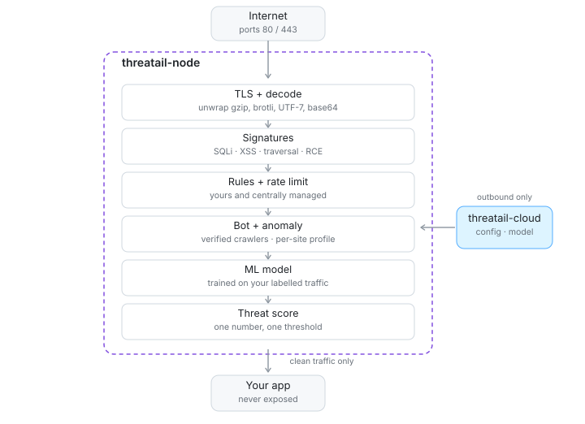

<h1 align="center">Threatail</h1>

  <b>A web application firewall you can install without touching your traffic.</b> 
  Runs as a reverse proxy on your own server. A single binary, no dependencies,
  no agent inside your application.

  <a href="https://lk.threatail.com"><b>Create an account</b></a> ·
  <a href="docs/deployment.md">Deployment</a> ·
  <a href="docs/detection.md">What it detects</a> ·
  <a href="docs/faq.md">FAQ</a> ·

  

---

## Start by looking, not blocking

A WAF sits in front of production and can take it down. That is the real reason most
teams put one off — not price, not features.

So this one is built to be run in **`detect` mode first**. It inspects every request and
records what it *would* have blocked, without changing a single response. Your site
behaves exactly as it did yesterday.

Two weeks in `detect` answers a question most teams cannot answer about their own site:
what is actually being aimed at it. Credential stuffing against the login form. Scanners
walking the API. Forged crawler user-agents. Clients replaying a modified mobile app
against your backend. You see all of it before deciding to block any of it.

You move to `protect` when the numbers look right — not because an installer told you to.

## How it inspects

Every request goes through the stages in the diagram above, in that order, inside the
node process. Nothing is sent anywhere to be decided.

**Decoding first.** Payloads are unwrapped before matching: gzip, deflate, brotli, UTF-16,
UTF-7, percent- and backslash-escapes, HTML entities, long base64 tokens. Comment-based
SQL obfuscation (`union/**/select`) is normalised away. All request headers are inspected,
not a shortlist — an attack can be carried in a header nobody thought to check.

**Signatures** cover SQL injection, XSS, path traversal, command injection, SSRF, XXE, SSTI,
LDAP injection and scanner fingerprints. They are confirmed field by field, so a phrase
split across two harmless parameters is not counted as an attack.

**Your rules and centrally managed rules.** Custom rules match on any part of the request
with a condition tree. Managed rules are virtual patches for known CVEs, delivered from
the cloud and applied without touching your application.

**Rate limiting** is per path prefix, keyed by IP, token, header or cookie. Over the limit
means a block or a proof-of-work challenge.

**Bots and anomalies.** Search crawlers are verified by forward-confirmed reverse DNS, so a
forged `Googlebot` is caught rather than trusted. In parallel the node builds a profile of
what normal traffic looks like on each path of your site and scores deviations from it.

**A model trained on your traffic.** Borderline requests are queued for you to label. Those
labels train a model for your site specifically — not a generic one shipped to everybody.

**One threat score.** Every signal contributes weighted points. A single threshold decides,
so one suspicious signal does not block a customer, and several together do.

## Where it runs

The node terminates TLS and proxies to your backend, so where you put it decides
everything else — most of all whether it sees the real client IP, which geo, rate
limiting, auto-ban and the behavioural profile all depend on.

| Shape | When it fits |
|---|---|
| In front of your server | the default, and the simplest |
| Behind a CDN or load balancer | you already use Cloudflare or similar |
| In front of a Kubernetes cluster | the app runs in k8s; the cluster is just an upstream |
| Several nodes | redundancy, or being closer to your users |

Details and the trade-offs of each: **[Deployment](docs/deployment.md)**.

Requirements are modest: Linux x86-64, ports 80 and 443, outbound HTTPS. No inbound access
from us is needed, ever.

## What leaves your infrastructure

Traffic does not. Every request is decided inside the node, on your server. The cloud is
for configuration, the trained model and the dashboard.

What is sent: **decisions and their evidence** — blocks, challenges, detections, and the
requests queued for review. An event carries the URL, headers, and a truncated fragment of
the body, because without them a detection cannot be judged. Ordinary passing traffic is
not recorded at all unless you switch full logging on.

If the cloud is unreachable, the node keeps serving traffic with its last known
configuration. An outage on our side does not take your site down.

## Getting started

1. **[Create an account](https://lk.threatail.com)** — no card required.
2. Add your site: domain and backend address.
3. Run the install command shown in the dashboard on your server.
4. Point DNS at the node and leave it in `detect`.
5. Read the events for a week or two, then switch to `protect`.

The dashboard walks through each step and tells you when the data says you are ready.

## Documentation

| | |
|---|---|
| [Deployment](docs/deployment.md) | topologies, requirements, real client IP, several nodes |
| [What it detects](docs/detection.md) | detectors, modes, threat score, false positives |
| [FAQ](docs/faq.md) | performance, failure behaviour, data, pricing questions |

Full reference — including rules, API protection, response inspection and the model —
lives inside the dashboard under **Documentation**, next to the settings it describes.

---

  <a href="https://lk.threatail.com"><b>Create an account →</b></a>

